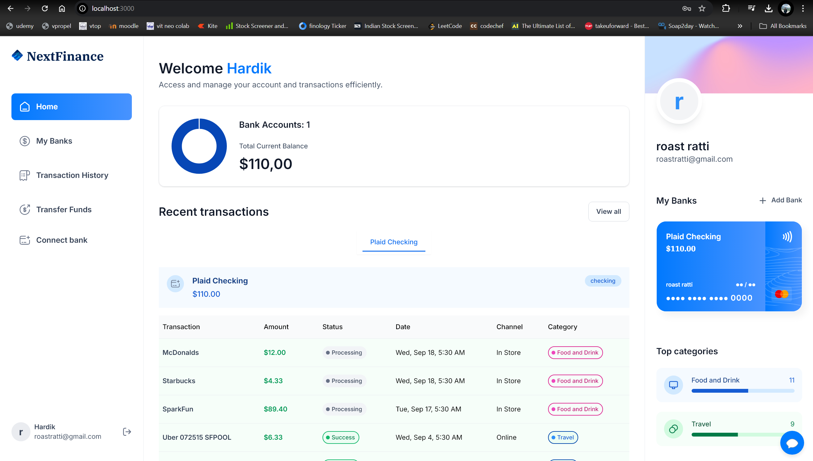
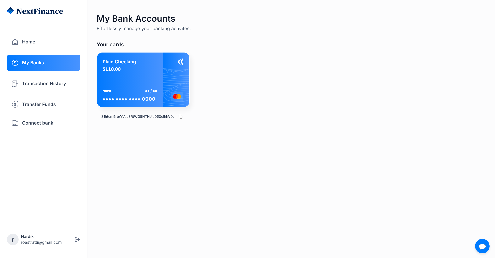
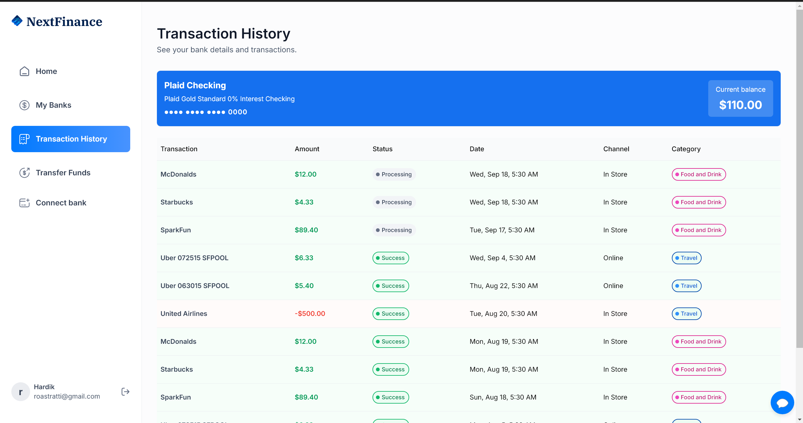
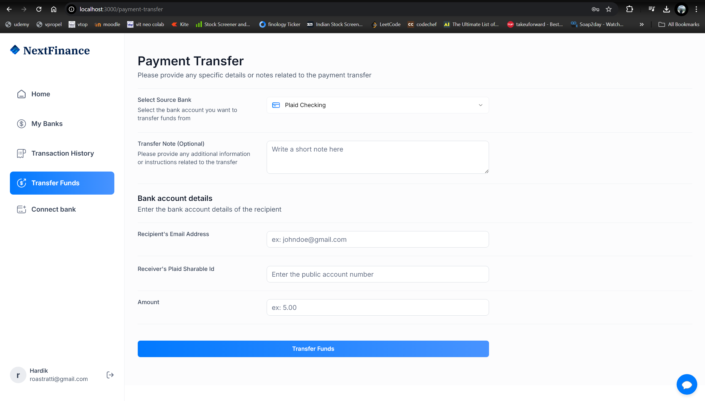
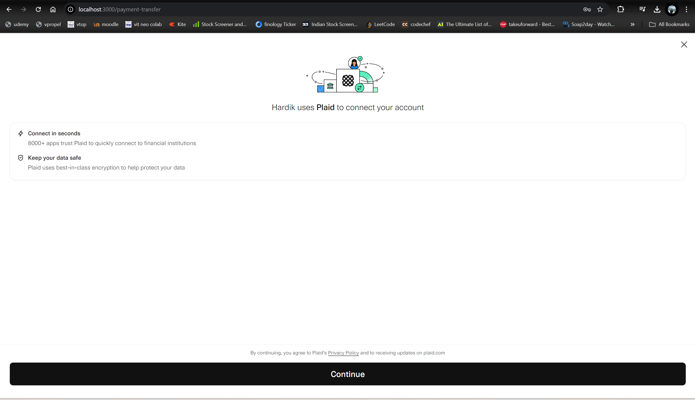

# NextFinance : Banking Webapp

Tech stack used :-

Next.js, Typescript, TailwindCSS,
Shadcn, AppWrite API, and Dwolla API.

Project Screenshots :-

# Home Page

 
 
# Bank Accounts

 
 
# Transaction History

 
 
# Transfer Funds

 
 
# Adding Bank account

 
 

